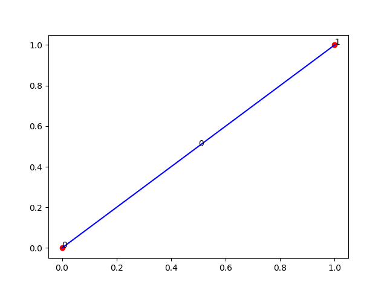
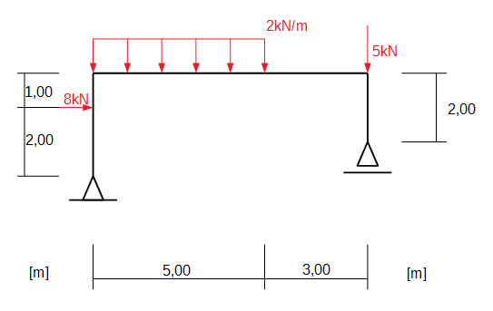
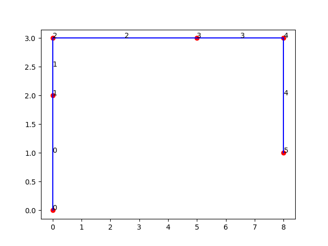

Examples
============================================
.. toctree::
   :maxdepth: 2
   
 
Basic FrameFEM methods
----------------------

:class:`fem.frame_fem.FrameFEM`

Creating fem-model for analysis
_______________________________
.. code-block:: python
	
	# Import FrameFEM -class
	from fem.frame_fem import FrameFEM
	
	# Initialize FrameFEM
	fem = FrameFEM()
	
Adding nodes to model
______________________

See :meth:`add_node <fem.frame_fem.FrameFEM.add_node>` for more detailed info.

.. code-block:: python

	# Import FEMNode
	from fem.frame_fem import FEMNode
	# Coordinates
	coord1 = [0, 0]
	coord2 = [1, 1]
	# Add nodes
	fem.add_node(coord1)
	fem.add_node(coord2)
	
Adding material
_____________________

:class:`Material <fem.frame_fem.Material>`

.. code-block:: python

	# Import Material -class
	from fem.frame_fem import Material
	E = 210e3 # Young's modulus [MPa]
	nu = 0.3 # Poisson ratio
	rho = 7850e-9 # Density [kg / mm^3]
	# Create Material
	mat = Material(E, nu, rho)
	# Add material
	fem.add_material(mat)
	
Adding section
_____________________
.. code-block:: python
	
	A = 1e3	# Cross-section area [mm^2]
	Iy = 1e6 # Second moment of area [mm^4]
	# Create BeamSection
	sect = BeamSection(A, Iy)
	# Add section to model
	fem.add_section(sect)
	
Adding elements
_____________________
   
You can add elements to the fem model using FrameFEM's :meth:`add_element 
<fem.frame_fem.FrameFEM.add_element>` -mehtod.

Currently FrameFEM supports three different element types:

* :class:`Element <fem.frame_fem.Element>`  base class for all elements
* :class:`EBBeam <fem.elements.EBBeam>` Euler-Bernoulli beam element
* :class:`EBSemiRigidBeam <fem.elements.EBSemiRigidBeam>` Euler-Bernoulli beam element with semi-rigid joints
   
.. code-block:: python
	
	# Import Euler-Bernoulli beam element
	from fem.elements.EBBeam import EBBeam
	# Get nodes
	n1, n2 = fem.nodes[0:2]
	# Get section
	sect = fem.section[0]
	# Get material
	mat = fem.materials[0]
	# Create element
	elem = EBBeam(n1, n2, sect, mat)
	# Add element
	fem.add_element(elem)
	
	
	
Adding loads
_____________________

Loads are added to the model using
:meth:`add_load <fem.frame_fem.FrameFEM.add_load>` -method.

You can add two types of loads,  
:class:`line loads <fem.frame_fem.LineLoad>`
or 
:class:`point loads <fem.frame_fem.PointLoad>`

.. code-block:: python
	
	# id for identifying loadcases
	load_id = 1
	
	# Create pointload
	n1 = fem.nodes[0]
	v = [10, 0 ,0] # load vector [Fx, Fy, Mz] [kN, kN, kNm]
	f = 1 # scaling factor
	pload = PointLoad(load_id, n1, v, f)
	
	# Create lineload
	eid = 0 # element subjected to the load
	xloc = [0,1] # starting and ending locations of the load (local coordinates)
	qval = [-10, -10] # load value [kN/m]
	direction = 1 # direction of load, 0: x-axis, 1: y-axis
	lineload = LineLoad(load_id, eid, xloc, qval, direction)
	
	# Add loads to model
	fem.add_load(pload)
	fem.add_load(lineload)
	
	
	
Drawing
______________________

You can draw you fem-model by calling :meth:`draw <fem.frame_fem.FrameFEM.draw>` -mehtod.

The red dots represents
:class:`FEMNodes <fem.frame_fem.FEMNode>`
and the number is their index in the FrameFEM's 
:attr:`nodes <fem.frame_fem.FrameFEM.nodes>` -list.

The blue line is :class:`element <fem.frame_fem.Element>` and the number is its index
int the FrameFEM's :attr:`elements <fem.frame_fem.FrameFEM.elements>` -list.

.. code-block:: python
	
	fem.draw()
	

	
	
Calculation examples
------------------------------

Calculating frame's support reactions
_________________________________________

Consider the frame below. Let's create a fem model using FrameFEM and calculate it's support reactions.

.. code-block:: python

	# Import dependencies
	from fem.frame_fem import FrameFEM, FEMNode, Material, BeamSection,\
		LoadCase, LineLoad, PointLoad, Support
	from fem.elements import EBBeam

	# Initialize fem
	fem = FrameFEM()

	# Nodal coordinates
	c1 = [0, 0]
	c2 = [0, 2]
	c3 = [0, 3]
	c4 = [5, 3]
	c5 = [8, 3]
	c6 = [8, 1]

	# Add nodes
	fem.add_node(*c1)
	fem.add_node(*c2)
	fem.add_node(*c3)
	fem.add_node(*c4)
	fem.add_node(*c5)
	fem.add_node(*c6)

	# Add section
	A = 1e3
	Iy = 1e6
	sect = BeamSection(A, Iy)
	fem.add_section(sect)

	# Add material
	E = 210e3
	nu = 0.3
	rho = 7850e-9
	fem.add_material(E, nu, rho)

	# Create and add elements
	for i in range(fem.nnodes()-1):
		n1 = fem.nodes[i]
		n2 = fem.nodes[i + 1]
		# using same section and material for every element
		sect = fem.sections[0]
		mat = fem.materials[0]
		elem = EBBeam(n1, n2, sect, mat)
		fem.add_element(elem)

	# Draw the frame to see if it's correct
	fem.draw()

	

.. code-block:: python

	# Add supports
	fem.add_support(1, 0, [0, 1], 0)
	fem.add_support(1, -1, [1], 0)

	# Add loads
	pl1 = PointLoad(2, fem.nodes[1], [8, 0, 0], 1)
	pl2 = PointLoad(2, fem.nodes[4], [0, -5, 0], 1)
	ll1 = LineLoad(2, fem.elements[2], [0, 1], [-2, -2], 1, 1)

	fem.add_load(pl1)
	fem.add_load(pl2)
	fem.add_load(ll1)

	# Add load case
	fem.add_loadcase(1, 2)

	# Calculate results
	fem.nodal_dofs()
	fem.linear_statics()

The minus sign '-' in front of the force lists is due to common sign convention.
The force -lists have force values in element's local coordinates.
	
.. code-block:: python

	# Print results
	print(f'Reaction at {c1}: Fx: {-fem.elements[0].shear_force[0]:.3f} kN,\
	Fy: {-fem.elements[0].axial_force[0]:.3f} kN') 
	print(f'Reaction at {c6}: Fx: {-fem.elements[-1].shear_force[0]:.3f} kN,\
	Fy: {-fem.elements[-1].axial_force[0]:.3f} kN')
	
	>>> Reaction at [0, 0]: Fx: -8.000 kN,Fy: 4.875 kN
	>>> Reaction at [8, 1]: Fx: -0.000 kN,Fy: 10.125 kN

.. _here: http://easystatics.com/frames/
	
The solution to this problem can be seen here_.
As we can see the results are correct.

	