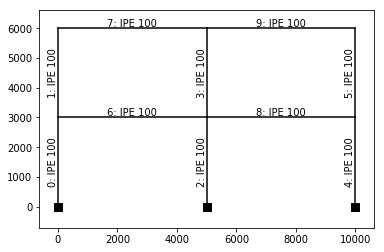
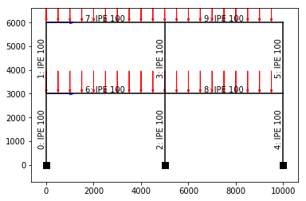
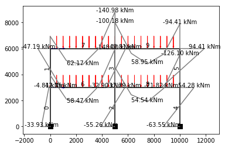
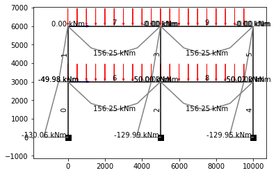
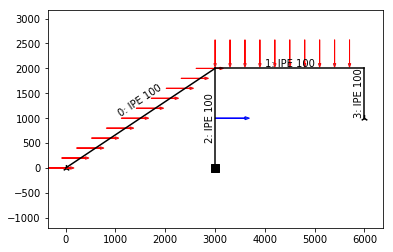
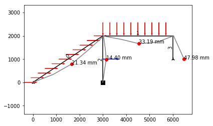
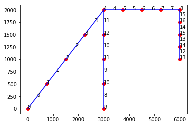

# Frame2D
## Portal Frame Example


```python
import sys
sys.path.append("C:/Users/huusk/OneDrive/Tiedostot/GitLab/frame2d/master")
```

### Import dependencies


```python
from src.frame2d.frame2d import *
```

### Create simple frame
You can create a simple symmetrical multistorey and -bay frame by using 'simple' argument when instantiating the frame object.

**Input arguments:**
 - simple (list) -- number and height for storeys and bays, [storeys, bays, storey height, bay length]
 - supports (string) -- creates supports to columns
 - num_elements (int) -- number of elements for each member


```python
num_storeys = 2
num_bays = 2
storey_H = 3000
bay_L = 5000
simple = [num_storeys, num_bays, storey_H, bay_L]
frame = Frame2D(simple=simple, supports='fixed')
frame.plot()
```





### Adding loads to beams
Every member has attribute 'mtype' which describes member's type.

It's easy to iterate through all members in the frame and choose every beam.

Frame2D -objects have attribute 'members', which is a dict where the key is the members id ('mem_id') and value is the member instance. Each member has an unique id by which they are identified. You can see members' id's when plotting the frame, member's id is the number before the name of the profile. 

Line loads are plotted as red arrows and point loads are blue arrows.


```python
beams = [mem for mem in frame.members.values() if mem.mtype == 'beam']
for beam in beams:
    lineload = LineLoad(beam, [-50, -50], 'y')
    frame.add(lineload)
# Add point load
pl1 = PointLoad([0, 3000], [30e3, 0, 0])
pl2 = PointLoad([0, 6000], [50e3, 0, 0])
frame.add(pl1)
frame.add(pl2)
frame.plot()
```





### Generating FE model and running linear analysis


```python
frame.generate()
frame.calculate()
```


```python
frame.bmd(20)
```





### Changing all beam-column connections to pinned
Calling method "hinge_joints" changes every beams' end connection to pinned.


```python
frame.hinge_joints()
frame.calculate()
frame.bmd(10)
```





### Full Code


```python
# Import dependencies
from src.frame2d.frame2d import *

# Create simple frame
num_storeys = 2
num_bays = 2
storey_H = 3000
bay_L = 5000
simple = [num_storeys, num_bays, storey_H, bay_L]
frame = Frame2D(simple=simple, supports='fixed')

# Add line load to every beam
beams = [mem for mem in frame.members.values() if mem.mtype == 'beam']
for beam in beams:
    lineload = LineLoad(beam, [-50, -50], 'y')
    frame.add(lineload)
    
# Add point load
pl1 = PointLoad([0, 3000], [30e3, 0, 0])
pl2 = PointLoad([0, 6000], [50e3, 0, 0])
frame.add(pl1)
frame.add(pl2)

# Generate FE model and run analysis
frame.generate()
frame.calculate()

# Plot bending moment diagram
frame.bmd(20)

# Change connections to hinges and plot new bmd
frame.hinge_joints()
frame.calculate()
frame.bmd(10)
```

## Custom Frame
You can create a custom frame by adding each member one by one or in a custom loop.


```python
# Initialize empty frame
frame = Frame2D()

# Create members
beam1 = SteelBeam([[0,0], [3000, 2000]])
beam2 = SteelBeam([[3000, 2000], [6000, 2000]])
col1 = SteelColumn([[3000, 0], [3000, 2000]])
col2 = SteelColumn([[6000, 1000], [6000, 2000]])

# Add members
frame.add(beam1)
frame.add(beam2)
frame.add(col1)
frame.add(col2)

# Create supports
sup1 = XYHingedSupport([0, 0])
sup2 = FixedSupport([3000, 0])
sup3 = YHingedSupport([6000, 1000])

# Add supports
frame.add(sup1)
frame.add(sup2)
frame.add(sup3)

# Create loads
pointload = PointLoad([3000, 1000], [100e3, 0, 0])
lineload1 = LineLoad(beam1, [10, 50], 'x')
lineload2 = LineLoad(beam2, [-30, -30], 'y')

# Add loads
frame.add(pointload)
frame.add(lineload1)
frame.add(lineload2)

# Generate FE model
frame.generate()

# Calculate
frame.calculate()

# Plot the frame
frame.plot()

# Plot deflected shape
frame.plot_deflection(scale=10)
```








### Getting force values from members

Each member has an attribute for the maximum normal force, shear force and bending moment value.


```python
for mem in frame.members.values():
    print(f'Maximum force values for member {mem.mem_id}: ')
    print(f'Normal force: {mem.ned * 1e-3 :.2f} kN')
    print(f'Shear force: {mem.ved * 1e-3 :.2f} kN')
    print(f'Bending moment: {mem.med * 1e-6 :.2f} kNm')
    print("")
```

    Maximum force values for member 0: 
    Normal force: 135.22 kN
    Shear force: -30.63 kN
    Bending moment: -15.79 kNm
    
    Maximum force values for member 1: 
    Normal force: 0.00 kN
    Shear force: 56.82 kN
    Bending moment: -35.47 kNm
    
    Maximum force values for member 2: 
    Normal force: -124.03 kN
    Shear force: 54.40 kN
    Bending moment: -28.48 kNm
    
    Maximum force values for member 3: 
    Normal force: -33.18 kN
    Shear force: -0.00 kN
    Bending moment: -0.00 kNm
    
    

### Accessing nodal forces and displacements
Each node's displacement is saved in member's 'nodal_displacements' -attribute.

'nodal_displacements' is a dict, where the key is node's id and value is displacement values

Nodal forces are saved similarly in 'nodal_forces' -dict.


```python
# Plot the FE model
frame.f.draw()

mem = beam1

for node, displacements in mem.nodal_displacements.items():
    dx, dy, rot = displacements
    fx, fy, mz = mem.nodal_forces[node]
    print(f'Displacement and forces for node {node}: ')
    print(f'X: {dx:.2f} mm')
    print(f'Y: {dy:.2f} mm')
    print(f'Rotation: {rot:.2f} radians')
    print(f'Normal force: {fx * 1e-3 :.2f} kN')
    print(f'Shear force: {fy * 1e-3 :.2f} kN')
    print(f'Bending moment: {mz * 1e-6 :.2f} kNm')   
    print("")
```





    Displacement and forces for node 0: 
    X: 0.00 mm
    Y: 0.00 mm
    Rotation: -0.02 radians
    Normal force: 135.22 kN
    Shear force: 9.37 kN
    Bending moment: 0.00 kNm
    
    Displacement and forces for node 1: 
    X: 11.42 mm
    Y: -16.14 mm
    Rotation: -0.02 radians
    Normal force: 127.72 kN
    Shear force: 4.37 kN
    Bending moment: 6.19 kNm
    
    Displacement and forces for node 2: 
    X: 15.51 mm
    Y: -21.34 mm
    Rotation: 0.00 radians
    Normal force: 120.22 kN
    Shear force: -0.63 kN
    Bending moment: 7.88 kNm
    
    Displacement and forces for node 3: 
    X: 10.37 mm
    Y: -12.80 mm
    Rotation: 0.02 radians
    Normal force: 105.22 kN
    Shear force: -10.63 kN
    Bending moment: 2.81 kNm
    
    Displacement and forces for node 4: 
    X: 3.05 mm
    Y: -1.14 mm
    Rotation: 0.01 radians
    Normal force: 75.22 kN
    Shear force: -30.63 kN
    Bending moment: -15.79 kNm
    
    
