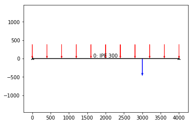
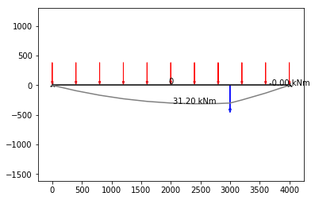
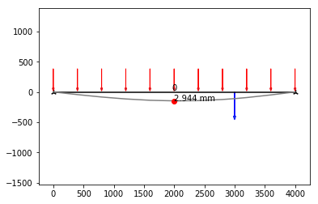

# Frame2D
## Creating and analyzing a simply supported beam

### Add path to your frame2d directory


```python
import sys
sys.path.append("PATH TO DIRECTORY, e.g. desktop/gitlab/frame2d/")
```

### Import dependencies


```python
from src.frame2d.frame2d import *
```

### Create empty frame "envelope"


```python
frame = Frame2D()
```

### Create beam and add it to the frame
SteelBeam takes coordinates as input.

Other optional keyword argumets are:
- profile (string) -- name of the profile
- num_elements (int)  -- number of elements
- material (string) -- material, e.g. S420


```python
coordinates = [[0, 0], [4000, 0]]
beam = SteelBeam(coordinates,
                profile='ipe 300',
                num_elements=10)
# Add beam to frame
frame.add(beam)
```

### Crate loads and supports

**Available load types:**
#### LineLoad

**Input parameters:**
    - member (FrameMember) -- member to which load is acting on
    - values (list) -- line load value at start and end [N/mm]
    - direction (str) -- direction of the load 'y' or 'x'
**Optional parameters:**
    - f (float) -- factor of which the load is multiplied
    - ltype (string) -- name type of the load, e.g. "snow", "wind"
    - name (string) -- name of the load
    
#### PointLoad
**Input parameters:**
    - member (FrameMember) -- member to which load is acting on
    - values (list) -- point load values [Fx, Fy, Mz] [N, N, Nmm]
**Optional parameters:**
    - f (float) -- factor of which the load is multiplied
    - ltype (string) -- name type of the load, e.g. "snow", "wind"
    - name (string) -- name of the load
    
    
**Available support types:**
- XHingedSupport
- YHingedSupport
- XYHingedSupport
- FixedSupport

**Input parameters for supports:**
    - coordinate (list) -- support's coordinate


```python
# Loads
pl = PointLoad([3000, 0], [0, -20e3, 0])
ll = LineLoad(beam, [-10, -10], 'y')
frame.add(pl)
frame.add(ll)
# Supports
sup1 = XYHingedSupport([0,0])
sup2 = XYHingedSupport([4000,0])
frame.add(sup1)
frame.add(sup2)
```

### Generating FE-model of the frame
Finite elements for each member has to be created before calculation.


```python
frame.generate()
```

### Running linear FE analysis


```python
frame.calculate()
```

### Full Code


```python
from src.frame2d.frame2d import *

# Create empty frame
frame = Frame2D()
# Create beam
coordinates = [[0, 0], [4000, 0]]
beam = SteelBeam(coordinates,
                profile='ipe 300',
                num_elements=10)
# Add beam to frame
frame.add(beam)
# Loads
p1 = PointLoad([3000, 0], [0, -20e3, 0])
ll = LineLoad(beam, [-10, -10], 'y')
frame.add(pl)
frame.add(ll)
# Supports
sup1 = XYHingedSupport([0,0])
sup2 = XYHingedSupport([4000,0])
frame.add(sup1)
frame.add(sup2)
# Generate FE-model of the frame
frame.generate()
# Run linear analysis for frame
frame.calculate()
```

## Plotting results

### Plotting frame


```python
frame.plot()
```





### Bending moment diagram


```python
frame.bmd(scale=10)
```





### Deflected shape


```python
frame.plot_deflection(scale=50)
```




